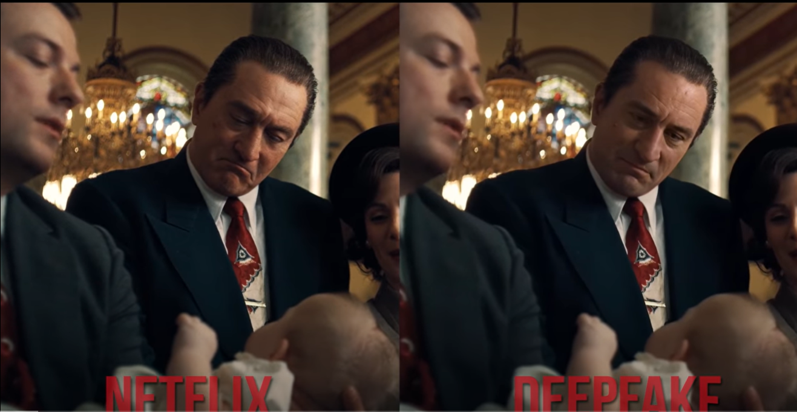
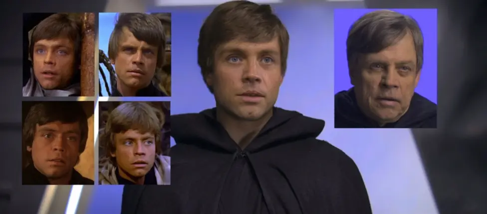
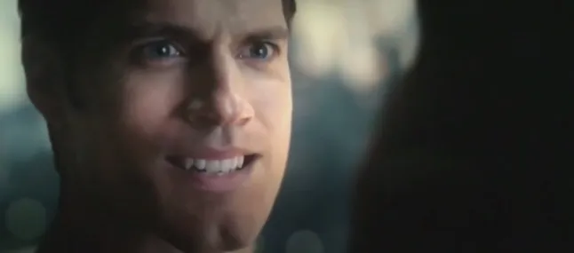
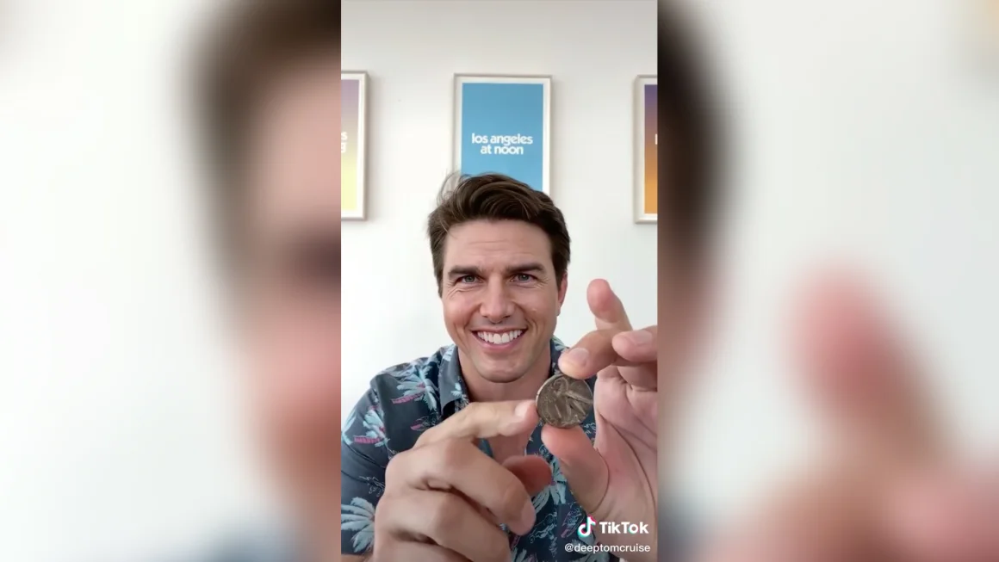

## **AI-Generated Content and Deepfakes in Entertainment**

### **Overview**
Maintaining digital authenticity in the entertainment industry is becoming increasingly difficult due to the rise of deepfakes and AI-generated misinformation. This project aims to develop a **deepfake detection system** using multimodal AI, integrating **Natural Language Processing (NLP) for text analysis** and **Convolutional Neural Networks (CNNs) for image and video analysis**. The goal is to classify media as authentic or manipulated, addressing the growing challenges of digital deception.

### **What are Deepfakes?**
Deepfakes are **AI-generated images, videos, or audio that manipulate real or fictional individuals**, often making it difficult to distinguish between authentic and synthetic content (Wikipedia, 2024). They are created using **machine learning techniques, deep neural networks, and generative adversarial networks (GANs)**.

**Types of Deepfakes:**
- **Textual Deepfakes** – AI-generated text mimicking real individuals (e.g., AI-generated scripts or fake celebrity social media posts)
- **Deepfake Videos** – AI-altered footage where faces and voices are replaced
- **Deepfake Images** – AI-generated or manipulated pictures (e.g., face swaps)
- **Deepfake Audio** – AI-generated voices mimicking real people
- **Live Deepfake Filters** – AI-powered filters that modify faces or voices instantly

### **Deepfake Use in the Entertainment Industry**
- **Personalized Viewer Experience**: AI enables users to swap actors in movies, selecting their preferred faces
- **Scene Reshoots**: Instead of expensive reshoots, deepfakes can modify expressions or actions in existing footage
- **Digital Avatars**: AI-generated avatars allow actors to appear in multiple projects or commercials without physically being present

### **Legitimate vs. Deceptive Uses of Deepfakes in Entertainment**
**Legitimate Uses of Deepfakes**

Deepfake technology has been integrated into the entertainment industry in controlled and ethical ways, primarily to improve storytelling and efficiency.

1. **CGI & VFX Enhancements** like **De-aging Actors**: Studios use AI-powered deepfakes to make actors appear younger for flashback scenes instead of using makeup or recasting
    - **Example 1**: The Irishman (Netflix) used deepfake-like AI to de-age Robert De Niro and Al Pacino
    
    *(Image credit: Shamook on YouTube)*

    - **Example 2**: The Mandalorian digitally recreated a young Luke Skywalker using deepfake
    
    *(Image credit: bbc newsaround)*

2. **Scene Reshoots & Post-Production Fixes**: Deepfake technology allows filmmakers to modify an actor’s facial expressions or lip movements without expensive reshoots

    - **Example**: In Justice League, Warner Bros. could have used deepfake tech to remove Henry Cavill’s mustache properly instead of using CGI (which resulted in unnatural visuals)

    
    *CGI removal of Henry Cavill’s moustache in Justice League (Picture: Warner Bros)*

3. **Voice Cloning for Dubbing & Localization**: AI-generated voices enable actors to "speak" multiple languages by adjusting lip movements and voice tones for different markets
    - **Example**: Disney+ and Netflix have experimented with AI-powered dubbing to improve global releases

4. **Bringing Deceased Actors Back to Screen**: Deepfake technology has been used to recreate late actors for final performances or cameos, with permission from estates
    - **Example**: Rogue One: A Star Wars Story recreated Grand Moff Tarkin (Peter Cushing) and a young Princess Leia (Carrie Fisher)
    
    *(Image credit: screenrant)*

5. **Personalized Entertainment Experiences**: Deepfake-based customization allows viewers to "swap" actors in a movie based on personal preferences
    - **Example**: AI-driven movie editing apps allow users to insert themselves into famous scenes

---

**Deceptive Uses of Deepfakes**

The use of deepfakes in the entertainment industry raises significant ethical and legal concerns, including issues related to **copyright infringement, defamation, and the invasion of privacy**. Unauthorized deepfakes can lead to **legal battles** and **damage the reputations of celebrities and studios**.

1. **Fake Celebrity Endorsements & Advertisements**: Deepfake ads have falsely made celebrities endorse products, deceiving fans and damaging reputations

    - **Example**: Deepfake Tom Cruise videos went viral on TikTok in 2021, showcasing how realistic fake content can be
    
    *This looks like Tom Cruise doing a coin trick, but it's actually a deepfake created by Chris Umé. From TikTok*

2. **Unauthorized Performance Replication**: AI-generated voices and faces can create fake performances, allowing unauthorized usage of an actor’s likeness
    - **Example**: Voice deepfakes of Morgan Freeman and David Attenborough have been used in unauthorized videos

3. **Deepfake Manipulation in Film & TV Leaks**: Fake movie clips or altered trailers can mislead audiences and create false hype or controversy
    - **Example**: AI-generated "leaked" scenes from upcoming Marvel movies have surfaced online, confusing fans

4. **Harmful Misinformation & Fake Interviews**: Deepfake AI can generate fabricated interviews or statements attributed to actors, potentially harming their reputations
    - **Example**: Fake interviews of actors spreading false information about upcoming projects

5. **Non-Consensual & Exploitative Content**: One of the biggest ethical concerns in entertainment is **unauthorized** deepfake videos used to manipulate actors into inappropriate content
    - **Example**: Several actresses have faced deepfake video scandals without their consent

### **Problem Statement**
As **deepfake technology** advances, **ensuring digital authenticity in the entertainment industry** has become **increasingly challenging**. Deepfakes are widely used for creative purposes, but **unauthorized use can damage reputations and careers**. There have been instances where actors' faces and voices were manipulated **without consent**, leading to misinformation, reputational harm, and ethical concerns.

This project aims to develop a **deepfake detection model** that can analyze digital content and determine its authenticity, helping to mitigate risks associated with AI-generated media.